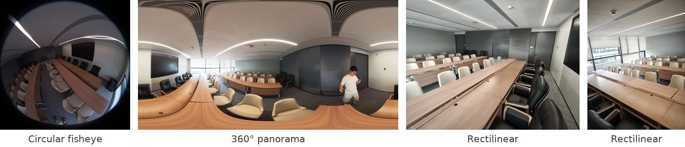
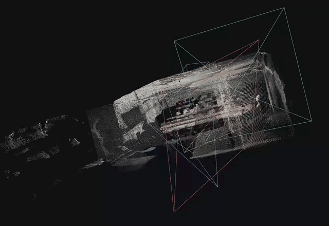
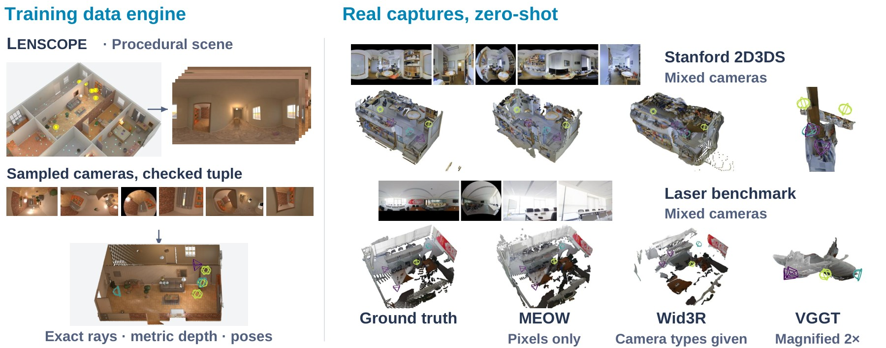
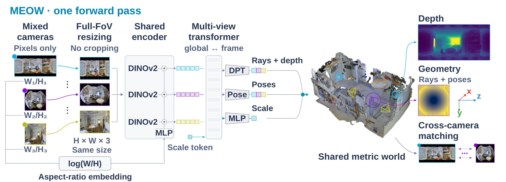
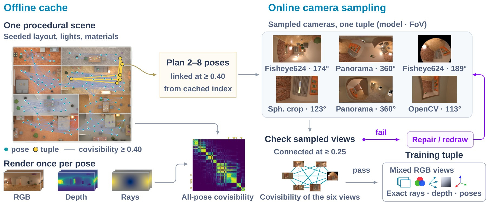
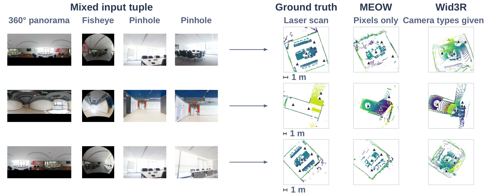
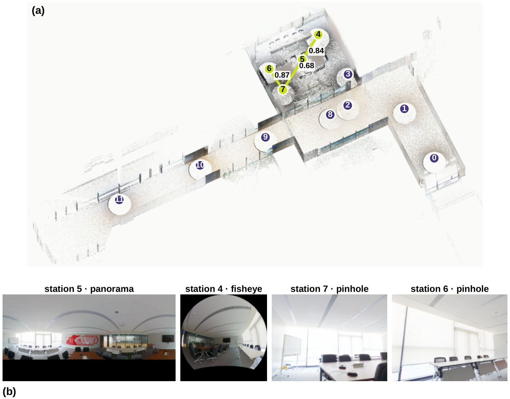

<div align="center">

# MEOW: Many Eyes, One World

### Feed-Forward 3D Reconstruction from Mixed Cameras

Qiaoge Li<sup>1</sup>, Yifan Zhan<sup>2</sup>, Haijun Yang<sup>1</sup>, Haiyang Liu<sup>2</sup>, Yiyi Cai<sup>2</sup>, Chenchi Luo<sup>1</sup>

<sup>1</sup>China Mobile Communications Company Limited Research Institute &nbsp;&nbsp; <sup>2</sup>The University of Tokyo

[](https://arxiv.org/abs/2609.35658)
[](https://github.com/qgli/MEOW-het/releases/tag/v1.0)
[](LICENSE)





<em>Four photos of one room from three camera types, reconstructed together in one forward pass with no calibration or camera labels; the frusta show the predicted cameras.</em>

</div>

## News

- **2026-09-29**: code, configurations, benchmark definitions and the laser-scan benchmark are released. Model checkpoints are coming soon.

## Overview

MEOW reconstructs metric pointmaps and camera poses from one tuple of views that mixes perspective,
fisheye and full 360-degree panoramic images, in a single forward pass and from the images alone: no
calibration, distortion parameters, camera-type labels or poses are needed for any view (full panoramas are recognised from their
pixels; some evaluation sets set the panorama flag for the whole set, see
[docs/EVALUATION.md](docs/EVALUATION.md)). It keeps a
perspective-pretrained backbone (MapAnything) and learns heterogeneous cameras from a procedural data
engine that renders each scene across a continuous range of camera models with exact rays and depth,
and certifies the covisibility of every camera-sampled training tuple.

<p align="center"></p>

<sub>MEOW reconstructs a shared 3D scene from mixed-camera images in one forward pass without supplied camera calibration or camera-type labels. Left: Lenscope generates mixed-camera training views from procedural scenes, checks their covisibility, and provides exact rays, metric depth, and camera poses for supervision. Yellow markers indicate the selected panorama centres. Right: reconstructions of mixed-camera tuples constructed from Stanford 2D3DS and laser-scanned panoramic captures. MEOW receives images only, while Wid3R additionally receives camera-type labels. Each point cloud is independently similarity-aligned to the ground truth for visualisation; VGGT panels are magnified 2&times;.</sub>

## Highlights

- **Mixed cameras, one forward pass.** A tuple may mix perspective, fisheye and full 360-degree panoramic
  views; metric pointmaps and camera poses for all views come from one forward pass over the images alone.
- **Zero-shot on real captures.** Trained on synthetic tuples only, MEOW reaches 80.4 mAA@30 on
  heterogeneous Stanford 2D3DS tuples, against 54.3 for Wid3R given the camera type of every view.
- **A laser-scanned benchmark.** Twelve registered Leica BLK360 G2 stations of a multi-room office, four
  tracks; on mixed tuples MEOW reaches 79.4 AUC@30, compared with 29.3 for Wid3R.
- **Lenscope data engine.** Procedural scenes, exact per-pixel rays and depth, and an online camera sampler
  whose training tuples are checked for covisibility after the cameras are sampled.

## Method

<p align="center"></p>

<sub>One forward pass. Views from different cameras are resized to one tensor shape with their full field of view; the native aspect of each (fixed to 2:1 for detected full panoramas) enters through an MLP added to its patch tokens. Sixteen alternating global and frame attention layers, a dense head per view (circular padding for panoramas), a pose head and a scale head give rays, depth, camera-to-world poses (OpenCV axes) and metric scale in one shared world. Inputs: a real tuple, zero-shot.</sub>

<p align="center"></p>

<sub>Lenscope. Offline, once per scene: a seed generates a procedural scene, panorama poses are placed in its free space, each pose is rendered with exact rays and depth; pairwise covisibility is computed by mutual visibility tests (lines: c<sub>kl</sub> &ge; 0.40). Online, per tuple: a connected walk plans 2&ndash;8 poses and each is resampled through a sampled camera. Covisibility is recomputed (edge width; dashed below 0.25) and only connected tuples are kept.</sub>

## Results

Heterogeneous Stanford 2D3DS tuples: 88 tuples of 3&ndash;24 views, one forward pass. Pose metrics are
computed per tuple and averaged over the 88 tuples; ATE is after Sim(3) alignment.

| Method | Camera input | RRA@30 | RTA@30 | mAA@30 | ATE &darr; |
|---|---|:-:|:-:|:-:|:-:|
| VGGT | None | 32.6 | 47.3 | 10.5 | 1.65 |
| &pi;<sup>3</sup> | None | 45.9 | 59.7 | 19.8 | 1.24 |
| MapAnything | None | 52.8 | 53.9 | 16.4 | 1.48 |
| CAM3R<sup>&dagger;</sup> | None | &ndash; | &ndash; | &ndash; | &ndash; |
| **MEOW (ours)** | None | 95.2 | **96.2** | **80.4** | **0.62** |
| Wid3R | Class per view | **96.9** | 86.5 | 54.3 | 0.83 |

<sup>&dagger;</sup>No multi-view weights released.

Laser-scanned benchmark, 24 four-view tuples per track. The first six metric columns are the mixed track
(panorama + fisheye + two pinholes); the last three are AUC@30 on the single-camera tracks. AUC@30 is the
mean over tuples; Acc and Comp are in metres after one alignment per tuple; NC is normal consistency.

| Method | Camera input | RRA@30 | RTA@30 | AUC@30 | Acc &darr; | Comp &darr; | NC | Panorama | Pinhole | Fisheye |
|---|---|:-:|:-:|:-:|:-:|:-:|:-:|:-:|:-:|:-:|
| DUSt3R | None | 62.5 | 67.4 | 32.9 | 0.164 | 0.863 | 0.758 | 0.5 | 96.0 | 73.8 |
| MASt3R | None | 66.7 | 66.0 | 31.8 | 0.182 | 0.508 | 0.737 | 2.7 | 96.2 | 56.2 |
| VGGT | None | 45.8 | 63.9 | 19.0 | 0.279 | 0.591 | 0.665 | 1.9 | 97.1 | 55.0 |
| &pi;<sup>3</sup> | None | 66.0 | 63.9 | 26.6 | 0.240 | 0.693 | 0.736 | 1.6 | **97.9** | 75.1 |
| MapAnything | None | 66.0 | 57.3 | 24.5 | 0.255 | 0.830 | 0.653 | 1.5 | 86.8 | 75.1 |
| **MEOW (ours)** | None | **100** | **100** | **79.4** | **0.142** | **0.367** | **0.809** | 71.0 | 85.7 | 73.2 |
| Wid3R | Class per view | 97.2 | 58.0 | 29.3 | 0.199 | 0.467 | 0.764 | 81.9 | 90.5 | **87.3** |
| PanoVGGT | Panoramas | &ndash; | &ndash; | &ndash; | &ndash; | &ndash; | &ndash; | **90.0** | &ndash; | &ndash; |

<p align="center"></p>

<sub>Laser-scanned mixed tuples, zero-shot. Each row shows the four inputs, the laser ground truth and the fused pointmaps of MEOW (pixels only) and Wid3R (camera types given), placed by the scorer's alignment. Top-down floor-to-wall slices coloured by height; triangles mark stations or predicted cameras.</sub>

The settings behind every number, including the resizing and routing controls, are listed in
[docs/EVALUATION.md](docs/EVALUATION.md).

## Laser-scan benchmark

<p align="center"></p>

<sub>The laser-scanned benchmark. (a) The merged point cloud of the twelve registered scanner stations, numbered 0&ndash;11: a corridor chain and a meeting room. The highlighted stations and links are one mixed tuple of the benchmark (stations 5, 4, 7 and 6); the numbers on the links are the covisibility between the station panoramas along the chain (0.84, 0.68 and 0.87). (b) The four views of that tuple as delivered to the models: a full panorama, a fisheye and two pinhole views resampled from the station scans.</sub>

The benchmark data is distributed as a separate archive under the Creative Commons Attribution 4.0 license
(CC BY 4.0): [meow_laser_benchmark.tar.gz](https://github.com/qgli/MEOW-het/releases/download/v1.0/meow_laser_benchmark.tar.gz) (636 MB,
SHA-256 `5279045d2c92d4290d83564422f91054cbdad6ca1930257575187feb17d36aa3`). Its tracks, gates and
construction are described in [docs/BENCHMARKS.md](docs/BENCHMARKS.md).

## Release contents

| | |
|---|---|
| Data engine | Lenscope in the paper: two scene generators with Blender, exact per-pixel rays and depth, offline covisibility, the online camera sampler used during training, and the conversion of laser scans into the same format ([docs/DATA_ENGINE.md](docs/DATA_ENGINE.md)) |
| Training | the three training stages as Hydra configurations, hardware profiles for 2 x RTX 5090, 4 and 8 x H200 and 8 x A100 40 GB, launch scripts and the Stage-3 relay ([docs/TRAINING.md](docs/TRAINING.md)) |
| Evaluation | benchmark construction scripts with their convention tests, evaluators and settings for every reported set, baseline drivers ([docs/EVALUATION.md](docs/EVALUATION.md), [docs/BENCHMARKS.md](docs/BENCHMARKS.md)) |
| Results | model checkpoints are not part of this release yet (coming soon); every reported number can be recomputed from scratch with the code, configurations and benchmark definitions here |
| Reproducibility | the checks run with this code ([docs/REPRODUCIBILITY.md](docs/REPRODUCIBILITY.md)) |

Model checkpoints, including both parents of the final model and the interpolation script, are not part
of this release yet (coming soon). The training data is not distributed: the scenes of both generations regenerate from their seeds with the
engine (see [docs/DATA_ENGINE.md](docs/DATA_ENGINE.md) for the Blender version and asset library this
requires).

## Quick start

```bash
python3.10 -m venv .venv && . .venv/bin/activate
pip install -r requirements.txt
export PYTHONPATH=$PWD:$PWD/third_party/uniception
python scripts/convert_hf_to_benchmark_checkpoint.py --apache \
    --output_path checkpoints/facebook_map-anything-apache.pth
```

Generate and render one first-generation scene, build its covisibility, draw one training tuple with the
online camera sampler and run ten optimiser steps as a pipeline check:

```bash
export WORK=$PWD/work BLENDER=/path/to/blender-4.5/blender
"$BLENDER" -b --python lenscope/gen1/generate_scene.py -- --seed 3 \
    --output_dir "$WORK/gen1/scenes" --room_type random --n_scenes 1
python lenscope/gen1/make_pick.py --blend-dir "$WORK/gen1/scenes" \
    --scenes proc_scene_000003 --out "$WORK/gen1/pick.json"
"$BLENDER" -b --python lenscope/gen1/render_fair_focal.py -- \
    --pick "$WORK/gen1/pick.json" --out "$WORK/gen1/packs" --num_poses 8 --samples 64
python scripts/compute_covisibility.py --root "$WORK/gen1/packs" --scenes proc_scene_000003 --overwrite
python scripts/repro/make_smoke_splits.py --scene proc_scene_000003 --out-dir "$WORK/gen1/splits"
python scripts/repro/smoke_injector_tuple.py --repo . --root "$WORK/gen1/packs" \
    --splits "$WORK/gen1/splits" --out "$WORK/gen1/tuple.json"
ENCODER_LR=0 scripts/repro/run_train_10steps.sh gen1 "$WORK/gen1/packs" "$WORK/gen1/splits" \
    checkpoints/facebook_map-anything-apache.pth "$WORK"      # ENCODER_LR=0 on 24 GB GPUs
```

## Repository layout

```
lenscope/          data engine: gen1/ (first generation), genesis/, core/, bpy/, fixtures/ (second
                    generation), blk/ (laser scans), tests/
mapanything/        MapAnything with the MEOW changes: model, losses, trainer, datasets, online camera
                    sampler (datasets/camera_sampler.py, connectivity.py)
third_party/        UniCeption 0.1.7 with the variable-resolution change
configs/            Hydra configurations; meow_stage/ and meow_hardware/ hold the MEOW recipes
scripts/            training launchers (train/), data preparation, evaluators, benchmark construction
                    (blk_bench/), baselines (competitor_baselines/), pipeline checks (repro/)
resources/          split files of both generations, first-generation frame statistics and feasibility
                    tables, all used by the training loader
benchmarks/         definitions of the evaluation sets (frame lists and tuples, no pixels)
docs/               installation, data engine, training, evaluation, benchmarks, reproducibility
assets/             figures and the animation shown in this README
```

## Citation

```bibtex
@article{li2026meow,
  title   = {Many Eyes, One World: Feed-Forward 3D Reconstruction from Mixed Cameras},
  author  = {Li, Qiaoge and Zhan, Yifan and Yang, Haijun and Liu, Haiyang and Cai, Yiyi and Luo, Chenchi},
  journal = {arXiv preprint arXiv:2609.35658},
  year    = {2026}
}
```

## License

The code is released under the Apache License 2.0 ([LICENSE](LICENSE)). It builds on MapAnything
(Apache License 2.0) and UniCeption (BSD 3-Clause); see [THIRD_PARTY_NOTICES.md](THIRD_PARTY_NOTICES.md)
for these and for the data and assets used at run time.
